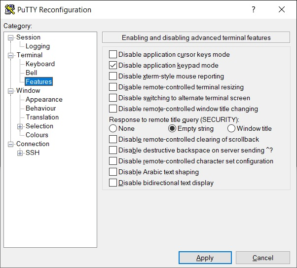

# Table des matières
- [Table des matières](#table-des-matières)
- [Documentation diverse et variée](#documentation-diverse-et-variée)
- [Configuration PuttY pour vi](#configuration-putty-pour-vi)
- [Aire de jeux](#aire-de-jeux)
- [Mes projets](#mes-projets)

*(Générée par https://derlin.github.io/bitdowntoc/)*

# Documentation diverse et variée

Avant tout commit, penser à positionner
```
[user]
	name = Geairare
	email = gco.alias@laposte.net
```

# Configuration PuttY pour vi

Pour les chiffres du pavé numérique sous vi, cocher "Disable application keypad mode"


# [Mes projets](https://github.com/Geairare/MesProjets#mesprojets)

# [Aire de jeux](https://github.com/Geairare/AireDeJeux#mon-aire-de-jeux)

Test modif en ligne
